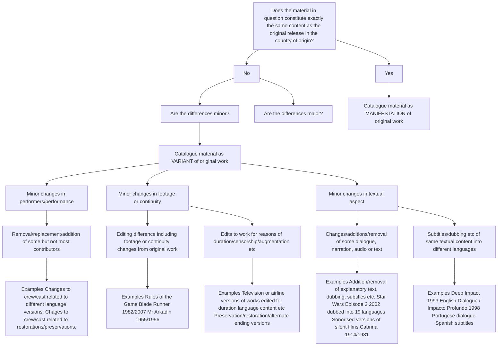

# 1.1 Boundaries between Works and Variants

This section looks at instances of when an entity constitutes a new Work or a Variant of a Work.

Determining boundaries between Works and Variants may sometimes rely upon a cataloguer’s judgment, however, in general: If much of the original textual material remains, most of the original footage remains in roughly the same continuity, however abridged, and  substantially  most  of  the  contributors  are  the  same,  the  existence  of  alterations more  often  than  not  constitute  a  Variant,  rather  than  a  new  Work.  An  institution  will need to set internal policies defining the minimum percentage of a work that has been extensively edited to qualify it as a new Work.

This  decision  tree  is  intended  to  help  cataloguers  determine  when  changes  in  content warrant the creation of a new Work record or a new Variant record. This distinction applies to cataloguing structures using a 4-level hierarchy: Work, Variant, Manifestation, and Item. When using a 3-level hierarchy - Work, Manifestation, and Item – minor changes will indicate new Manifestations rather than new Variants. In all cases, major changes warrant the creation of new Work records.

