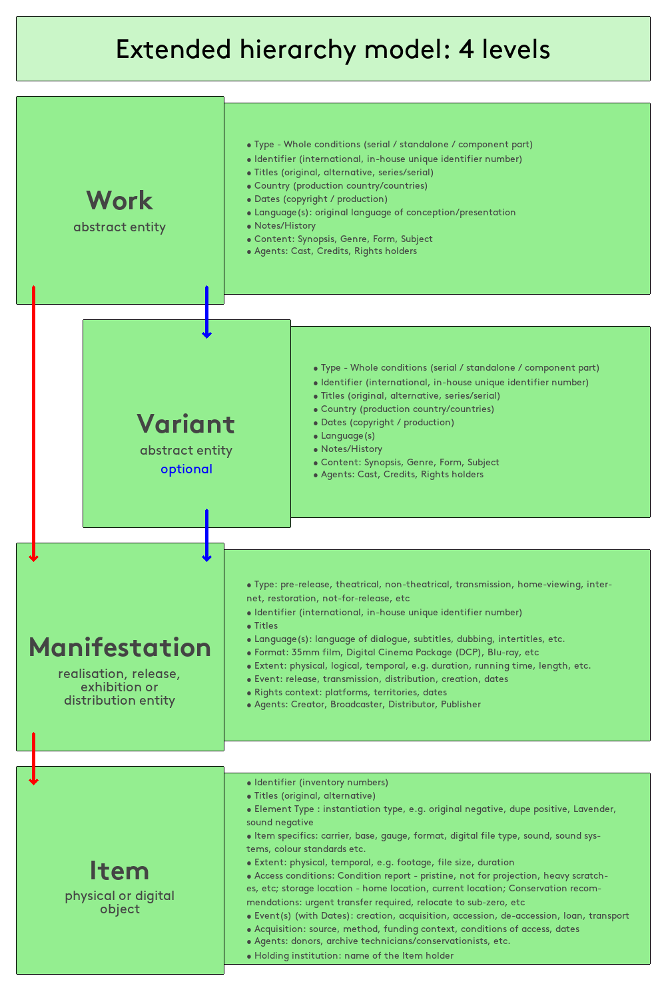

This site is a technical demonstration of how the [FIAF Cataloging Manual](google.com) could be represented as a static markdown-sourced site.

#### Footnote

This is a very interesting sentance. [^1]

#### Example

```
Lawrence of Arabia (1962)
```

#### Diagram



#### Lists

- First item
- Second item
- Third item

#### Table

| Work | Variant | Manifestation | Item |
| -- | -- | -- | -- |
| Identifiying | Identifiying | | |  
| Preferred |  Preferred | | |  
| | | Title Proper | Title Proper | 
| Other title information | Other title information | Other title information | Other title information | 
| Alternative | Alternative | Alternative | Alternative | 
| Supplied/Devised | Supplied/Devised | Supplied/Devised | Supplied/Devised | 

[^1]: Footnote information.
